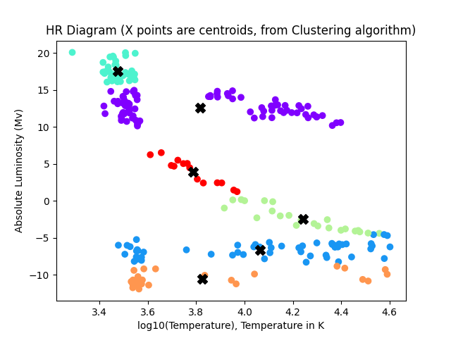

# 🌌 Star Classifier Model using TensorFlow and K-Means Clustering

## Overview

This repository presents a scientific machine learning pipeline for **stellar classification and exploration of stellar populations**, inspired by astrophysical data analysis practices commonly used in space science institutions.

The project combines:

* **Supervised Deep Learning (TensorFlow / Keras)** for classifying stars into physical stellar classes.
* **Unsupervised Learning (K-Means Clustering)** to visualize stellar populations on the **Hertzsprung–Russell (HR) Diagram**, revealing natural groupings driven by stellar evolution.

The model classifies stars based on physical parameters such as **surface temperature, relative luminosity, relative radius, color, and absolute magnitude**, and demonstrates how machine learning can faithfully recover known astrophysical structures.

---

## Repository Structure

```
STAR CLASSIFIER/
├── kMeans_model.sav           # K-Means Clustering Model
├── Stars.csv                  # Stellar dataset (from Kaggle)
├── train_model.py             # Model training script
├── evaluate_model.py          # Model evaluation and metrics generation
├── HRdiagram.py               # HR diagram generation and clustering
├── data_info.py               # Dataset inspection and metadata
├── scaler.pkl                 # Saved feature scaler
├── star_classifier_model.h5   # Trained TensorFlow model
├── confusion_matrix.png       # Confusion matrix visualization
├── roc_curve.png              # ROC curves and AUC
├── HR diagram.png             # HR diagram with K-Means centroids
├── dict.json                  # Label mapping and metadata
```

---

## Model Evaluation Results

The trained neural network achieves **very high classification performance** on the stellar dataset, with:

* Near-perfect accuracy on the validation set
* Stable convergence after 150 epochs
* Low categorical loss values

Evaluation metrics include:

* Accuracy
* Precision
* Recall
* F1-score
* Confusion Matrix
* ROC Curves and AUC (multi-class)

These results indicate that stellar classes are strongly separable in the chosen feature space, consistent with astrophysical expectations.

---

## HR Diagram and K-Means Clustering

The repository includes an unsupervised clustering analysis using **K-Means (k = 6)** to generate an HR diagram.

**Axes used:**

* X-axis: `log10(Temperature)`
* Y-axis: `Absolute Magnitude`

K-Means clustering automatically identifies stellar populations corresponding to:

* Brown Dwarfs
* Red Dwarfs
* White Dwarfs
* Main Sequence Stars
* Supergiants
* Hypergiants

The resulting **Silhouette Score ≈ 0.63**, indicating strong and physically meaningful clustering. Cluster centroids are visualized directly on the HR diagram.



---

## Dataset

The dataset used in this project is publicly available on Kaggle:
"https://www.kaggle.com/datasets/brsdincer/star-type-classification"

The dataset contains labeled stellar data derived from astrophysical catalogs and is widely used for educational and research purposes.

---

## Model Architecture

The neural network architecture is intentionally simple and interpretable:

* **Input Layer:** Stellar features
* **Hidden Layer 1:** Dense(64), tanh
* **Hidden Layer 2:** Dense(32), tanh
* **Hidden Layer 3:** Dense(16), Softplus
* **Output Layer:** Dense(6), Softmax

**Training Configuration:**

* Optimizer: Adam
* Loss Function: Sparse Categorical Crossentropy
* Metrics: Accuracy
* Epochs: 150
* Batch Size: 24

This architecture balances expressive power with computational efficiency and aligns well with the physical structure of the data.

---

## Model Performance Summary

* Classification Accuracy: ~100%
* Stable loss convergence
* High separability across stellar classes
* Strong agreement between supervised labels and unsupervised clustering

These results demonstrate that machine learning can successfully capture the **underlying physics of stellar evolution**.

---

## Applications

* Stellar classification pipelines
* Educational demonstrations of HR diagrams
* Astrophysical data analysis
* Feature engineering experiments for scientific ML
* Portfolio project for scientific machine learning

---

## Author

Developed by Jovan, an independent researcher with a background in **physics and scientific computing**, exploring the intersection of astrophysics and machine learning.

---

## License

This project is released under the **MIT License**, allowing free use, modification, and distribution for academic and commercial purposes.

---

> *"Machine learning does not replace physics — it reveals it."* 🌠
